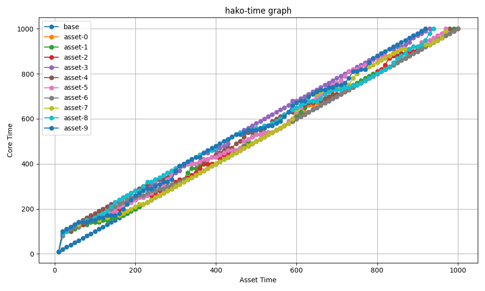

# これは何？

箱庭の時刻同期機能について、定量評価を行う。

# 目的

箱庭コア機能が、箱庭時刻同期の定義に従い、シミュレーションにおける時刻同期を適切に行っていることを確認する。複数の箱庭アセットがシミュレーション内で時刻同期されている際、最大許容遅延時間やアセット数を変化させた場合の挙動を測定し、定義通りの動作を検証する。

特に以下の2点を確認する。

* 時刻同期の精度：箱庭時刻と各箱庭アセット時刻の差が定義された最大許容時間範囲内に収まっているか。
* シミュレーションの実行速度：アセット数の増加や最大許容遅延時間によるシミュレーション速度の変化が想定通りか。

---

# 測定内容

箱庭時刻同期の定義に基づき、箱庭コア時刻と各アセットの時刻が許容範囲内で同期しているかを確認する。さらに、最大許容遅延時間やアセット数の変化による挙動も評価する。

**測定項目**:
1. **箱庭時刻とアセット時刻の差**：箱庭コア時刻と各アセットの時刻が定義された最大許容遅延時間内に収まっているかを確認する。
2. **シミュレーション実行時間**：アセット数や最大許容遅延時間の変化に伴うシミュレーション実行時間の変化を測定する。

**パラメータ設定**:
- ステップ時間：10msec
- ステップ数：1,000ステップ（合計シミュレーション時間10秒）

**可変パラメータ**:
- 最大許容遅延時間：10msec, 20msec, 40msec, 80msec, 100msec
- 箱庭アセット数：1, 2, 4, 8, 10

**測定方法**:
1. 各パラメータ設定において、箱庭時刻と各アセット時刻の差を記録し、最大許容遅延時間内に収まっているかを確認する。
2. 各シミュレーションの総実行時間を計測し、並行動作の効率を評価する。

---

# 測定条件と測定項目

## 測定条件

- サンプル数：10件
- 箱庭アセット：Python版の箱庭アセットを使用
- 箱庭アセットの処理内容：1ステップ毎に10,000回ビジーループを実行

## 測定項目

- 箱庭時刻および各アセットの時刻
- 箱庭時刻 - 箱庭アセット時刻の平均値
- 箱庭時刻 - 箱庭アセット時刻の標準偏差

---

# 測定環境

- M2 MacBook Pro

---

# 期待値

以下の期待値を設定する。

1. **箱庭時刻 - 箱庭アセット時刻の平均値**  
   箱庭アセットの時刻が箱庭コア時刻と同期している場合、平均値は「0」に近くなる。最大許容遅延時間の範囲内であれば、アセット数や遅延時間が増加しても、平均値は大きく逸脱しない。

   **期待値**:  
   - 各パラメータ設定において、箱庭時刻とアセット時刻の差は最大許容遅延時間以下であること。
   - アセット数が増加すると若干の遅延が発生するが、最大許容遅延時間内であること。

2. **箱庭時刻 - 箱庭アセット時刻の標準偏差**  
   箱庭時刻同期の精度が高い場合、各アセット時刻間のばらつき（標準偏差）は小さくなる。特に最大許容遅延時間が小さい設定では、標準偏差が小さくなる。一方、許容遅延時間が大きい設定では標準偏差が大きくなるが、並行動作の効率は向上する。

   **期待値**:  
   - 最大許容遅延時間が小さい場合、標準偏差は小さい。
   - アセット数が増えると標準偏差は増加するが、箱庭時刻同期の許容範囲内に収まる。
   - 最大許容遅延時間が大きい場合、標準偏差は大きくなるが、並行動作の効率は保たれる。

---

# 評価基準

以下の2点を確認する。

- 基準1. 箱庭時刻とアセット時刻の差が、最大許容遅延時間内に収まっているか
- 基準2. アセット数と最大許容遅延時間の変動によって、シミュレーションの実行速度と時刻のバラつきが想定通りであるか

---

# 測定結果

## 基準1に対する結果

全てのデータに対して、箱庭時刻とアセット時刻の差が最大許容遅延時間内に収まっていることを確認した。具体的な結果は以下の通り。

- 5件(最大許容遅延時間) x  1アセット x 10 サンプル:  50件全てOK
- 5件(最大許容遅延時間) x  2アセット x 10 サンプル: 100件全てOK
- 5件(最大許容遅延時間) x  4アセット x 10 サンプル: 200件全てOK
- 5件(最大許容遅延時間) x  8アセット x 10 サンプル: 400件全てOK
- 5件(最大許容遅延時間) x 10アセット x 10 サンプル: 500件全てOK

なお、箱庭時刻と箱庭アセット時刻の時間変化をイメージしやすいように、上記サンプルの中で代表的なものをグラフ化したものを下図に示す。



(箱庭アセット数=10, 最大許容遅延時間=100msec)

## 基準2に対する結果

### 箱庭アセット数×総処理時間
下図に示す通り、アセット数が増加するに従い、総処理時間が増えることを確認した。また、最大許容遅延時間が増加するに伴い、総処理時間が減少していることも確認できた。

以上より、最大許容遅延時間とアセット数の増加に応じて、処理時間が想定通り変化していることが確認された。


### アセット数 x 遅延時間の標準偏差

最大遅延時間が増加するに従い、標準偏差も増加していることが確認されたが、いずれの場合もおおよそ30msec程度に収まっている。

この結果より、最大許容遅延時間の増加に伴う時刻のばらつきは予想通りであり、許容範囲内で動作していると判断できる。


### アセット数10の時の総処理時間x遅延時間の標準偏差

総処理時間と標準偏差が反比例の関係にあることが確認された（期待通り）。具体的には、以下の傾向が見られる。

精度を高く（最大許容遅延時間を小さくする）すると、総処理時間が増加し、標準偏差は小さい。
精度を低く（最大許容遅延時間を大きくする）すると、総処理時間が減少し、標準偏差は大きい。
この結果より、総処理時間と標準偏差の間のトレードオフが予測通りに動作していることが確認された。


なお、アセット数が10未満の場合は、総処理時間と標準偏差の間の明確な傾向を捉えることが難しかったため、アセット数10の結果のみを示している。

# 評価

本測定では、箱庭コア機能が定義された時刻同期の基準を満たしているかどうかを、以下の2つの基準に基づいて検証した。

1. **基準1：箱庭時刻とアセット時刻の差が最大許容遅延時間内に収まっているか**  
   測定結果から、すべてのサンプルにおいて箱庭時刻とアセット時刻の差が最大許容遅延時間内に収まっていることが確認された。よって、箱庭コアの時刻同期機能が正確に動作していることが確認された。

2. **基準2：アセット数と最大許容遅延時間の変動によるシミュレーションの実行速度と時刻のばらつきが想定通りか**  
   最大許容遅延時間の増加によって、総処理時間は減少し、標準偏差が増加するという反比例の関係が確認された。また、アセット数の増加に伴って処理時間が増加する傾向も確認された。アセット数が10未満の場合には明確な傾向が確認できなかったものの、アセット数10のケースでは予想通りの挙動が確認できた。

---

これらの結果から、箱庭時刻同期機能は期待通りの動作を示しており、複数アセットがシミュレーション内で正確に時刻同期されていることが確認された。また、最大許容遅延時間やアセット数に応じたシミュレーション速度やばらつきの変動も、想定通りの範囲内で動作していることが明らかとなった。

今後の改善点としては、より多くのアセット数や異なるシステム条件でのテストを実施し、さらなるスケーラビリティの検証を行うことが考えられる。また、アセット数が少ない場合に観測された傾向の曖昧さに関しても、追加の解析やパラメータ調整によってより明確な結果を得ることが可能と考えられる。

# 環境構築手順

以下を実施してください。

```
cd hakoniwa-core-cpp-client
bash build.bash clean
export ENABLE_HAKO_TIME_MEASURE=ON
export ASSET_NUM=10
bash build.bash
bash install.bash
```

# 測定手順

以下を実行するだけです。

```
cd hakoniwa-core-cpp-client/examples/measure
bash run.bash
python calc-final-results.py 
```

測定結果は、以下の容量で格納されます。

```tree
results
├── <サンプル番号>
│   ├── result-m<アセット数>-d<最大許容遅延時間>
│   ├── asset-<アセット番号>-measure.csv
│   │   ├── elapse.txt
│   │   └── stddev.txt
```
 
- サンプル番号：0-9
- アセット数：評価項目に従う
- アセット番号：0からの連番
- asset-<アセット番号>-measure.csv
  - real-time, core-time, asset-timeのデータが格納されます。
  - real-time: リアル時間
  - core-time: 箱庭時刻(usec)
  - asset-time: 箱庭アセット時刻(usec)
- elapse.txt: 処理時間（リアル時間）
- stddev.txt: 箱庭コア時刻-箱庭アセット時刻の標準偏差

## 基準1 のチェック方法

```
bash check-time.bash | tee log.txt
grep NG log.txt
```

NGが出力されなければOK。

## 基準2のデータ

以下に配置されています。

```
ls ./final_results.csv 
./final_results.csv
```

## 基準2のグラフ化方法

### 箱庭アセット数×総処理時間

```
python plot-final-results.py --csv-file final_results.csv --plot-type elapse-vs-multi
```

### 箱庭アセット数×遅延時間の標準偏差

```
python plot-final-results.py --csv-file final_results.csv --plot-type stddev-vs-multi
```

### アセット数10の時の総処理時間x遅延時間の標準偏差

```
python plot-final-results.py --csv-file final_results.csv --plot-type stddev-vs-elapse --multi-num 10
```


### 各種ツールの役割

* ./run.bash
  * 全体の評価を実行するスクリプト
* ./calc-final-results.py
  * 基準2の結果を出力するスクリプト
  * ./calc-result.py
    * 最終結果をための準備スクリプト
* ./check-time.bash
  * 基準1をチェックするスクリプト
  * ./check-time-diff.py
    * 各CSVファイルをチェックします
* ./plot-final-results.py
  * 基準2をグラフ化するスクリプト
* ./measure.bash
  * ./master.py
  * ./measure-asset-run.bash
  * ./asset_measure.py
* ./graph.py
  * 個々のCSVファイルをグラフ化してくれます。詳細を理解したい場合に使います。
* ./plot-results.py
  * 平均化前の個別のデータをグラフ化してくれます。
